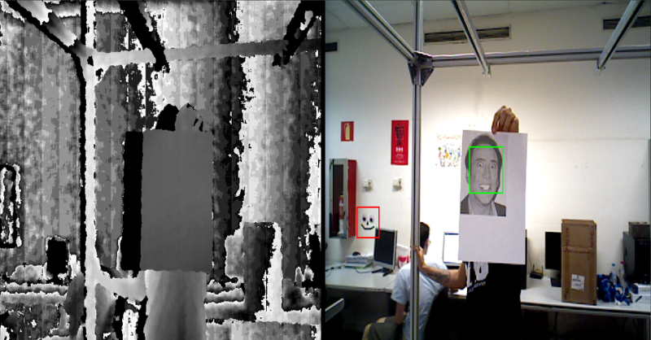

# follow-me

A robotic face following and arm waving demo.

Link to Doxygen generated documentation: http://robots.uc3m.es/dox-follow-me

How to run the demo: [Spanish guide](http://robots.uc3m.es/index.php/Procedimiento_Demos)

    

## follow-me app program and connection diagram

## follow-me dialogue manager state machine diagram

